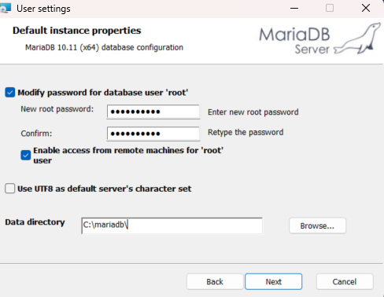
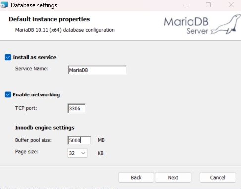
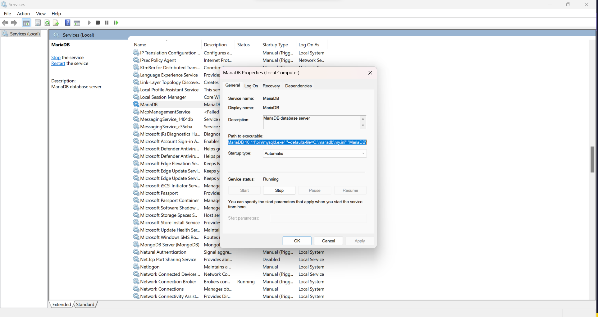

# MariaDB

- [Maria DB Download](https://mariadb.com/downloads/)
    - choose Version and OS
    - dowload and Install
## Installation: Default Instance properties
- **Modify password for database user 'root':**
    - create a password and confirm it( keep track of this password)
- **Enable access from remote machines for 'root' user**
    - root users having remote access, is not acceptable for prodcution environments, will cause an issue whne downloding for testing or production
    - for non prod and non testing environments it is ok
    - if checked this will create a two root user, with `User: root, Hostname: % (wild users)` and `User: root, Hostname:localhost`
        - if anyone has the root credentials they can login for any machine
    - if unchecked one root user will be created, with `User: root, Hostname:localhost`
- **Data Directory:** you can click browse button and choose you own data directory
    - can create a folder in the c drive and use it
    - can also use the default if you choose to

----
- **Insatll as Service : Service Name:** can use the default name `MariaDB
    - for production this should be changed
    - can find this service in windows by typing services in the search bar
- **Enabling Network: TCP Port:** can use default port 3306
- **Innodb engine settings:**
    - maria db default store engine is Innodb
    - there are different store engines such as ARIAL, MEMORYM TOKUDB, MYISAM etc... there are as many as 10 engines
    - **Buffer Pool size:**
        - Performace Tuning Parameters:
            -  `innodb_buffer_pool`: it is a standard to allocate 70% of RAM, so if you have 8GB of RAM allocate 5000 MB(Memory Capping)
    - **Page size:**
        - MariaDB Row Format is dynamic by default
            - for SQL Server we have MDF, NDF and LDF file systems
            - for each table space we create MDF file(data files)
            - for each table space it will grow dynamically
            - there are different options such as redundant, compress etc..
        - you can keep 16 but 32 is best for your oltp operations

  

---
## Configuration files
- Linux OS: My.cnf
- Windows OS: My.ini
    - Search For Services ---> MariaDB ---> Right Click Properties

           

---
- [MariaDB Versions Releases](https://mariadb.com/kb/en/mariadb-server-release-dates/)
    - long term vs short term releases
    - short term does not get any security patches long term does