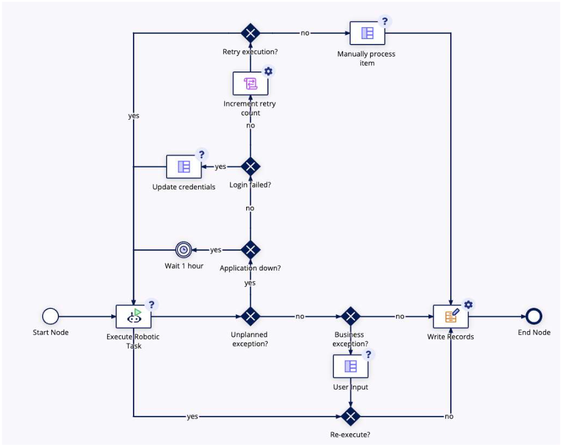

# Robotic Integration in Process Model
- Once your RPA integration object is created you need to call it in a process model using the **[Execute Robotic Task smart service](https://docs.appian.com/suite/help/23.4/Execute_Robotic_Task.html)**
- you need to specify 
    - the name of the RPA integration that is set up for the Execute Robotic Task operation
    - the number of automatic retries upon execution failure
        - retry behavior if it fails the first time
        - the smart service automatically retries when the robotic tasks fails
        - use dropdown or expression editor to set the number of retries, must be between 0 and 5 inclusive
- After an integration is selected on the Setup tab, the integration's inputs will automatically appear as node inputs on the Data tab
    - **Node Inputs:**
        - the integration's inputs will automatically appear as node inputs
        - if you change the selected integration or the inputs of the selected integration are updated outside the process modeler, the node inputs will be refreshed the next time you view the Data tab
    - **Node Outputs:** 
        - Decide whether and where to save the node outputs
        - In the Execute Robotic Task smart service, the Variables parameter in the Output tab would be mapped to a process variable. This parameter uses the Map() data type.
        - [More Info](https://academy.appian.com/#/online-course-player/a11e15e0-bea2-4218-9ace-9bd2903a1299)
- Smart service runtime behavior
    - once the task starts running and the Execute Robotic Task smart service is initiated
    - the integration calls the chosen robotic task
    - the smart service waits for the robotic task to finish before moving forward in the process model
**The robotic task continues running in the background even if the process model is paused, canceled, or deleted. To pause or cancel the robotic task, you’ll need to go to the robotic task instance in the Appian RPA console**

## Handling business and system exceptions
- When a robotic task runs into a business exception, such as manual approval is needed, or data is missing, the robotic task must terminate and notify a user of the exception
- To do this, the robotic task must return the exception and related data to the process model so the user can be notified with relevant information
- To set up this exception handling, create two variables in your robotic task
    - A **status flag** (boolean) to indicate if a certain business exception has occurred
    - An **exception message** (text) to provide details on the business exception
    
- In the process model, use an XOR gateway to evaluate the values of the status flag returned by the robotic task and route the workflow accordingly
- Example of a business exception in the robotic task triggers a task to a user for further troubleshooting. If there is no business exception, data can be written to a record. 
    
---

