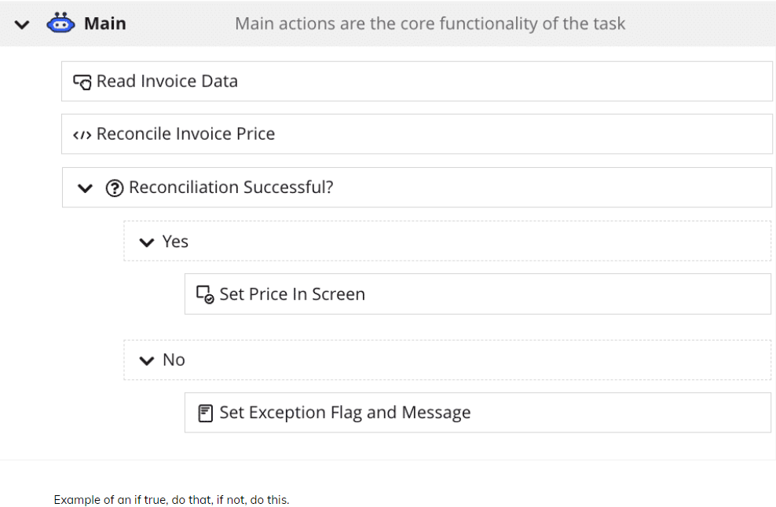
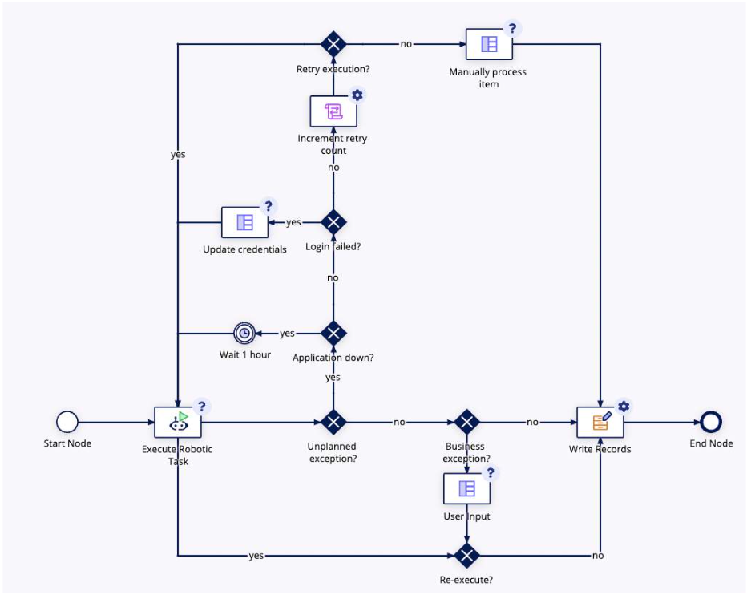

# Robotic Task Integration
**How to incorporate a robotic task into your overall business process**

## Create design objects: connected system and integration
**To execute a robotic task, you will need a WebAPI key, connected system and an integration design object**
1. Create Web API Key: required for Appian RPA to communicate with your application
- an API key is created through the Admin Console from the Web API Authentication tab
- add it to a service account
- add the service account to the administrators group
    - ensure the WebAPI has access to the objects needed to trigger a robotic task
- copy the API key to add it to the connected system
2. Create an Appian RPA Connected System
    - choose Appian RPA
    - paste the generated API key into the configuration
3. Create an integration to execute a robotic task
    - create a new integration using the created Appian RPA Connected System
        - choose **Execute Robotic Task**
    - Configure Integration
        - use the dropdown to choose the robotic task that this integration will trigger
            - service account needs to be part of the application administrators group for the robotic task to be visible in the dropdown
        - Configure Description and Priority as needed
        - create rule inputs and map them to the appropriate parameters

---
## In the process model, add and configure the smart service to run a robotic task
1. Edit Process model: to call the RPA integration using the **Execute Robotic Task smart service**
    - add the Execute Robotic Task smart service to the appropriate place in your process model to configure the smart service
2. Configure the smart service settings on the Setup tab
    - select the RPA integration
    - edit integration
    - set retries
        - retry behavior if it fails the first time
        - the smart service automatically retries when the robotic tasks fails
        - use dropdown or expression editor to set the number of retries, must be between 0 and 5 inclusive
3. Configure Additional Settings on the Data Tab
    - **Node Inputs:**
        - the integration's inputs will automatically appear as node inputs
        - if you change the selected integration or the inputs of the selected integration are updated outside the process modeler, the node inputs will be refreshed the next time you view the Data tab
    - **Node Outputs:** 
        - Decide whether and where to save the node outputs
        - [More Info](https://academy.appian.com/#/online-course-player/a11e15e0-bea2-4218-9ace-9bd2903a1299)
- Smart service runtime behavior
    - once the task starts running and the Execute Robotic Task smart service is initiated
    - the integration calls the chosen robotic task
    - the smart service waits for the robotic task to finish before moving forward in the process model
**The robotic task continues running in the background even if the process model is paused, canceled, or deleted. To pause or cancel the robotic task, you’ll need to go to the robotic task instance in the Appian RPA console**
## Add other nodes to the process model to handle business and system exceptions
- When a robotic task runs into a business exception, such as manual approval is needed, or data is missing, the robotic task must terminate and notify a user of the exception
- To do this, the robotic task must return the exception and related data to the process model so the user can be notified with relevant information
- To set up this exception handling, create two variables in your robotic task
    - A status flag (boolean) to indicate if a certain business exception has occurred
    - An exception message (text) to provide details on the business exception
    
- In the process model, use an XOR gateway to evaluate the values of the status flag returned by the robotic task and route the workflow accordingly
- Example of a business exception in the robotic task triggers a task to a user for further troubleshooting. If there is no business exception, data can be written to a record. 
    
---

