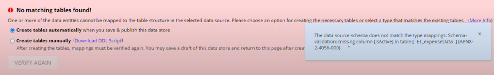

# Updating CDT via XSD
- if there are fields in the CDT but not in the database there will be an issue
    - a `No matching tables found` error will show
    
    - can remove the extra column from the CDT, or add the column in the database
    - or you can modify the XSD file
- if there are fields in the database but not in the CDT there will be no issue