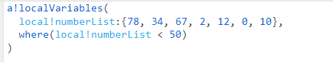
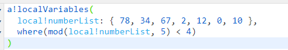
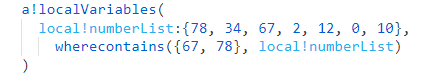
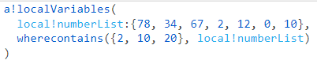

## `append(array, value)`
- append a structure or value to an array
- ex. If we have an editable grid and we need to add rows, we can use the append function to add a blank structure to the exsiting array

---

## `joinarray(array, separator)`
- concatenates the elements of an array together into one string and inserts a string separator between each element

---

## reverse( array )
- returns an array in reverse order

## `where(array)`
- returns the indexes where the values in the input array are true
- useful for finding values in an array that meet a certain criterion
- useful for checking the value of a field in an array of CDT field values
- if all values are false and no default is specified, an empty set is returned
### where() Examples
- returns the indexs where the values are less than 50: 
- returns List of Numbers {2, 4, 5, 6, 7}

    
---
- returns the index of the number if the number divided by 5 has a remainder that is less than 4
- returns List of Numbers {1, 3, 4, 5, 6, 7}

    
    
---

## `wherecontains(value, array)`
- return indexes of an array that match a user-defined value/values
- useful for finding which items in a CDT array have the same value for a field

### wherecontains() Examples
- returns a list conatining the indexes of 67 and 78
- returns List of Numbers {1, 3}

    
---
- will give only the index of the numbers that exist
- returns List of Numbers {4, 7}

    

---

## `index(data, index, default )`
- returns the data at a specified index if it is valid or else returns the default value
- can return the values of an array at the indexes you gathered with the wherecontains() function

---