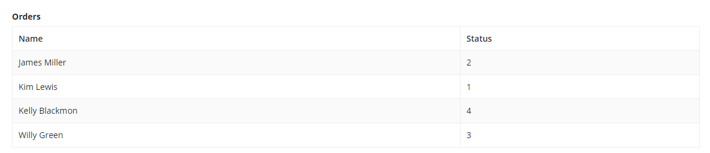
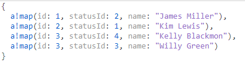
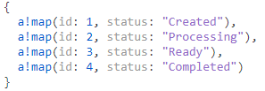
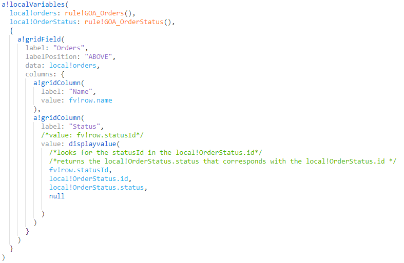
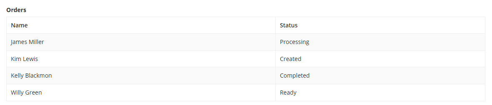

# displayvalue() Function

`displayvalue( value, inArray, replacement, default )`
- tries to match a value in a given array with a value at the same index in a replacement array
- returns either the value at the same index or a default value if the value is not found
- typically used to return a text display value that corresponds to an ID value stored in a process variable and makes it easier to generate reports that show human-readable values instead of numeric IDs in process data

## Example
**Replace with a value that is coming from another set of data**
- `displayvalue()` is often used to replace a value with another value
- below is a read only grid that contains a list of orders
- the status column displays the status id, but we nned to display the status name instead
    

    - below is the structure of the order data, and there is only a statusId but no status name

        

    - below is the structure of the status data, would be the ref table
        - the statusId in the order data refers to the id of the status in the status data

        

- here the `displayValue()` functions is being used
    - `rule!GOA_Orders()` holds the orders data and is placed in the local variable `local!orders`
    - `rule!GOA_OrderStatus()` holds the status data and is placed in the local variable `local!OrderStatus`

    

    - in the status column the `displayValue()` function looks for the `statusId` in `local!OrderStatus.id` and returns the `local!OrderStatus.status` that corresponds with the `local!OrderStatus.id`
    - the resulting grid is shown below

    