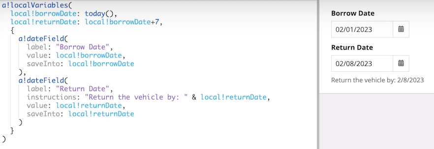

# [Local Variales](https://docs.appian.com/suite/help/23.3/Local_Variables.html#configuring-refresh-behavior)
- locally stored/cached data
- define and store temporary variables that can only be accessed within the function that defines them
- variables are considered dependencies even if they are only used within a part of the expression that isn't evaluated
- defined within the `a!localvariable()` function
    - the first parameters are reserved for the name and value of the variables
    - type is determined by the value
    - the last parameter is reserved for the evaluation of the variables
    
- when querying data you might want to query the database once the store it in a local variable and reference that variable when needed, if not then you would be querying the data every time you need it(performace)
- most local variables can be updated through a `saveInto` parameter
- some local variable configurations can make that variable an invalid save target
---

## Default Refresh Behavior
- all variables defined within the a!localVariables() function 
    - refresh when a referenced variable in the value configuration changes
    
        - when `borrowDate` changes `returnDate` will automatically update by seven days at the same time
        - you can change these refresh behaviors using the `a!refreshVariable()` function, only available within an interface
        - local variables that are used within interfaces can refresh their values under a variety of conditions
    - you can still save into variales that can be updated automatically
- **Never refresh:**
    - variables with no dependencies will never refresh
- **Referencing specific fields within a variable:**
    - if a local variable depends on a specific field within another variable, it will only refresh when that field is updated
    - applies for both dot indexing and bracket indexing
    - `local!titles: rule!getTitlesByDepartment(ri!employee.department)`
        - will only refresh when `ri!employee.department` field changes
    - also work for array indexing, but if you need to use the index function to provide a default value, then you need to place the index function in an intermediate local variable to achieve the same behavior

---
## Disable Default Refresh Behavior: `refreshOnReferencedVarChange` 
- set the `refreshOnReferencedVarChange` parameter of the `a!refreshVariable` function to `false`
    - if you want to make a copy of a variable for later comparison
    - if you simply don't want something to be calculated each time a variable it depends on changes

- `a!refreshVariable(value: local!fullName)` here fullName is the value when its created
- if the users changes either field it will only update that field
- if the user changes the value in the Full Name text field only `local!fullName` will change not `local!preferredName`
- if the user changes the value in the Preferred Name text field only `local!preferredName` will change not `local!fullName`
-----
## Disable Default Refresh Behavior: `refreshOnVarChange`
- refresh a local variable based on when a specific variable not refrenced in the value changes 
- set the `refreshOnVarChange`  parameter of the `a!refreshVariable` function to the variable you want it to change based on


- everytime the `local!username` changes, the `local!usernameEditedTimestamp` will change

---

## Disable Default Refresh Behavior: `refreshInterval`
- refresh automatically on a timer
- set the `refreshInterval`  parameter of the `a!refreshVariable` function to the time you want it to changed based on


- [More](https://docs.appian.com/suite/help/23.4/Local_Variables.html#configuring-refresh-behavior)
---

## Disable Default Refresh Behavior: `refreshAlways`
- trigger refresh based on user interaction
- set the `refreshAlways` parameter of the `a!refreshVariable` function to `true`
- will refresh the variables whenever the user interacts with any of the interface components
- will refresh on every interaction regardless of whether or not the dependencies change


```
local!department: index(ri!employee, "department", "None"),
local!titles: rule!getTitlesByDepartment(local!department),
```
- `local!department` depends on the entire value of `ri!employee` and will update whenever any field within it changes
- `local!titles` will only update when the value of `local!department` changes
- the value of `local!department` won't change unless the `department` field changes, the same effect is achieved


Different between loads with evaluated?

load(): Lets you define local variables within an expression for an interface and evaluate the expression with the new variables, then re-evaluate the function with the local variables' values from the previous evaluation.

with(): Lets you define local variables within a function and evaluate the expression with the new variables. Note: In interfaces, this function differs from the load() function because it recalculates the local variable values after interactions. This recalculation always happens, even if the interaction's updates could not have impacted the variable's value. This means data queries and other slow operations in with() variables can have important performance impacts.

Have a look at the new evaluation function, a!localVariables(). It does everything load() does but with additional refresh options that may drastically simplify your design.