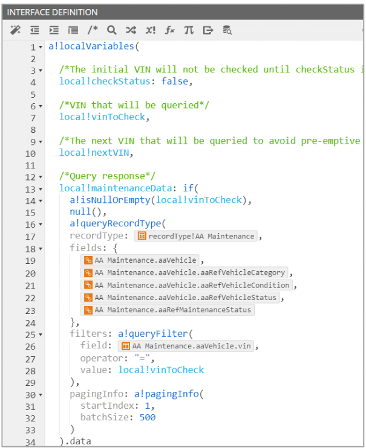

# Portal
- a public web app that is used to connect your users to the data and workflows in your Appian applications
- use a portal when the users who you expect to use application are not authenticated Appian users
- the portal can be accessed from outside of appian so unauthenticated users can access it
    - a user would only need to go to a public URL on a web browser or mobile device
- users can still interact with some Appian processes from a portal
    - can start appian processes and send data
    - Sites enable authenticated users to manage requests/data and other work submitted through the portal
- portal can be used to write data, such as completing a survey, giving feedback, completing an application, register for an event, report an incident, start an onboarding process, or view public records etc...
- can **Configure portal as a progressive web app**, which provides a more polished experience for users that want to install the portal on their device
- need to create a **Service Account**
    - acts on behalf of your portal users
    - records, processes, and documents stored in Appian won't be available in your portal until you give your service account access to them
    - make sure the service account doesn't have access to record types that aren't used in your portal
    - only system administrators can create a service account 
    - needs initator access to process models
- The header is optional if your portal has only one page
---
## Portal Security
- Portals are publicly accessible, but that doesn't mean they aren't secure
- the service account is used to control access to your Appian environment
    - provides the portal with permissions to connect to selected information and processes in Appian
    - can create the service account directly from within the portal object, but then you'll need to add this account as a user to your app’s All Users group (or any other group that you want to use for your portal’s security)
---
## Publish Test and Deploy A Portal
- You typically only need to publish the portal once. Appian will automatically republish the portal upon deployment, or if you update the portal object or its precedents
- If you no longer want the portal to be available to users, you can easily unpublish it by toggling off Publish in the portal object. Remember to save changes
- For a portal to auto-publish in a new environment, set up a service account in the new environment with the same username and group membership as the service account in the source environment
- To test, navigate to the published portal and use it the way the end user would
    - must publish your portal to fully test it
    - once published anyone with the web address can access your portal
    - to limit access to a portal while you're working on it, Appian adds a UUID to the web addresses of portals in your development and testing environments
    - This setting can be changed in the Administration Console, In production environments, this option is deselected by default to make URLs easier to remember. 
    - The setting below is not available for editing in your Appian Community Edition environment
- To deploy a portal to another environment, add it and all precedents to the deployment package
    - After you publish it in your development environment, Appian will automatically publish the portal after deployment to a new environment
    - make sure your target environment has:
        - the groups that your portal uses for permissions
        - a service account with the same name as the service account in your source environment
        - permissions for the service account that match those in the source environment

---

## Working with Data using Record Types
- most common way to work with data in portals is using record types
- with record types you can implement Appian functions `a!startProcess` and `a!queryRecordType` to easily flow the data between your app and the portal

### Launch a Process with a!startProcess
- can launch a process from the portal by configuring the underlying interface with the a!startProcess function
- this is the only way to start a process via a portal
- Example, you can configure the Submit button to launch a process model in Appian. You'll design the process model like any other process, configuring it to meet your business needs such as writing data or assigning tasks.

### Display Data with a!queryRecordType
- if your app uses record types and you want your portal to display data from Appian, configure the underlying interface using the a!queryRecordType function
- Example, you can add a local variable and then used the a!queryRecordType function to query the reord type

### Monitoring Portals
- After publishing your portal, it's important to monitor your portal's performance
- On the Portal Monitoring tab of the Monitoring page, you’ll be able to view key metrics about how your portals are performing across environments. 
- Understanding how your users are experiencing your portals helps you create portals that are responsive, reliable, and available to all users.

### Other Portal Configurations
- Use custom domains so your portal URLs are consistent with other enterprise URLs, 
    - all portals have a set URL that uses the Appian environment name for the subdomain and appianportals.com for the domain
        - `environmentname.appianportals.com`
    - Using a custom domain, portal URLs can use a domain that you define such as `web.insurecorp.com`
- Use reCAPTCHA for protection against spam
    - can configured the form to block submissions if a bot is likely using the form
    - can configure your portal to use Google’s reCAPTCHA services to handle potentially malicious behavior or misuse. You’ll use the function `a!verifyRecaptcha()` on a submit button
- Use URL parameters to provide targeted experiences for users
    - you can create dynamic experiences that change based on the values passed into the portal with rule inputs
    - Example: When prospective customers enter their data and receive a personalized quote, they receive an email with a link to return to that quote, URL parameters can be used to serve each user the right content and populate the interface with personalized information