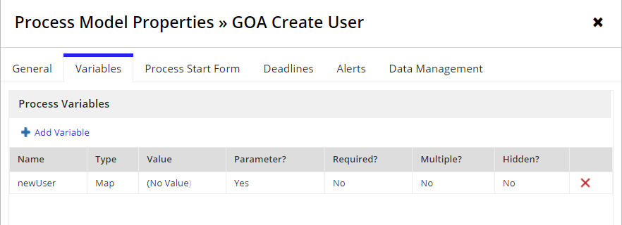
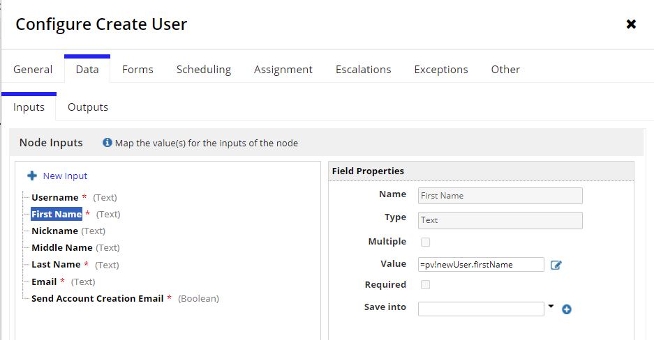
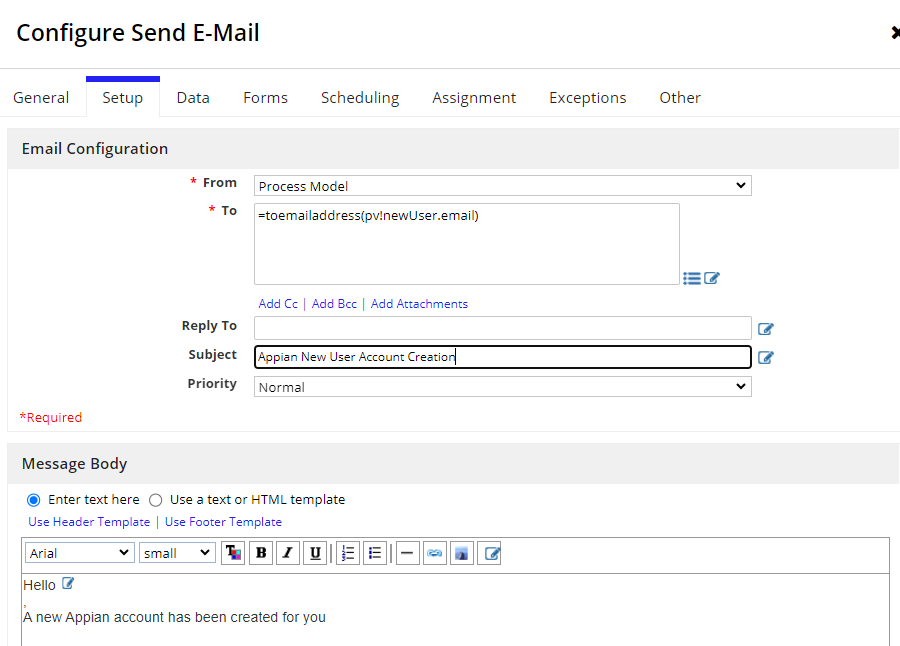
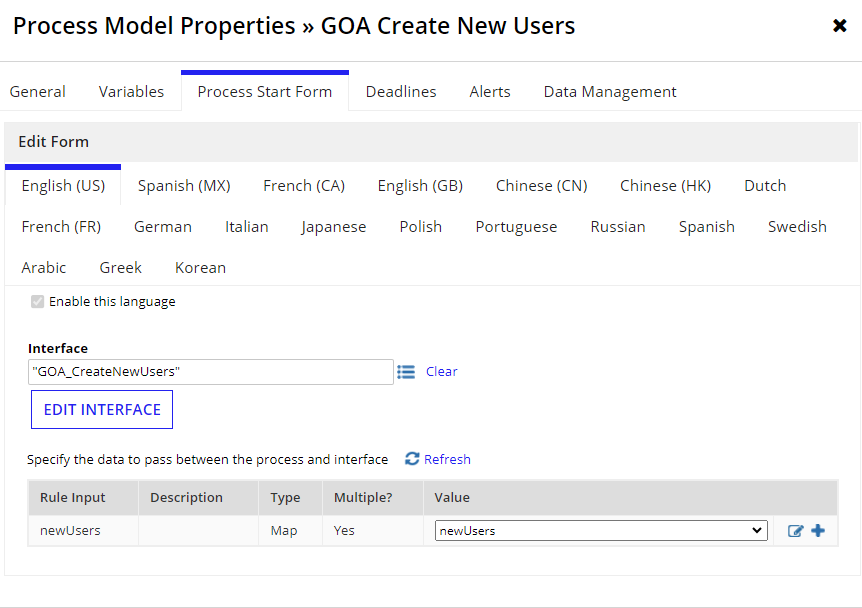
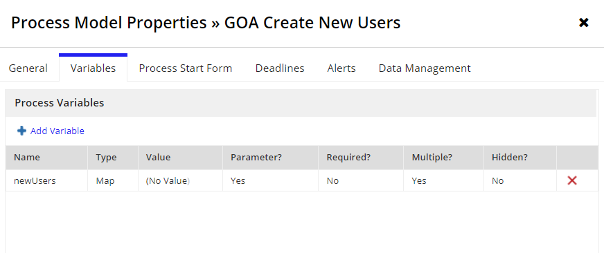
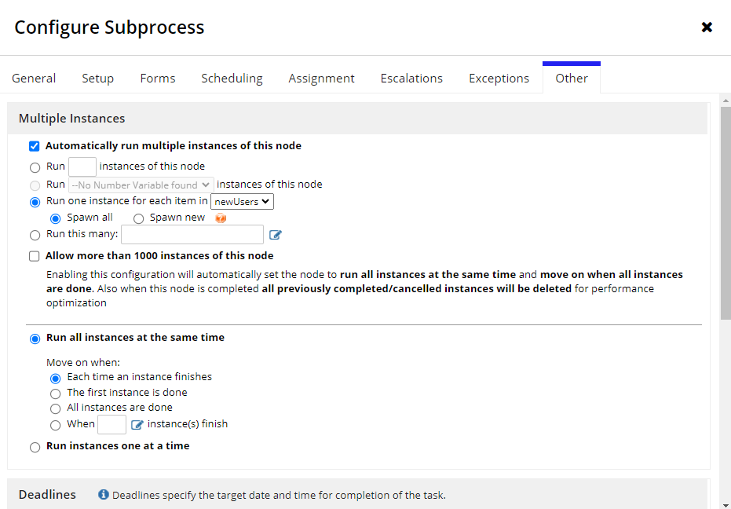
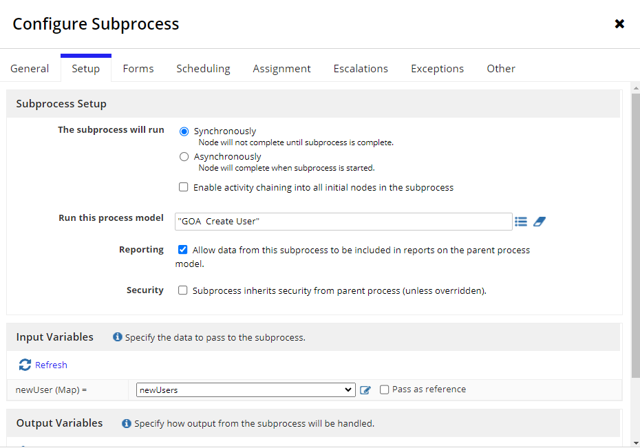

# Muti-Node Instances Example
**Execute any node mutiple times in a single process flow**
- can use it in a user input task to assign that task to a list of individuals rather than just a group or single user
- another common use is to spawn mutiple instances of a child process
- can pass in a list of dictionaries, maps, records etc...
## Example: Create Users in Bulk
- What You Need:
    - Interface
    - Two process Models
        - Parent Process Model
        - Child Process Model

### Create New Users Interface: Editable Grid
1. Use a Form Layout
2. Create a rule input of type array of Map
    - `newUsers` 
3. Create Columns
4. Create column Config
5. Rows
6. Add row link
#### Interface: 
- Editable Grid

        a!formLayout(
            label: "Create New Users",
            contents: {
                a!gridLayout(
                label: "Editable Grid",
                labelPosition: "ABOVE",
                headerCells: {
                    /*Every appian new user needs at least these four fields*/
                    a!gridLayoutHeaderCell(label: "First Name"),
                    a!gridLayoutHeaderCell(label: "Last Name"),
                    a!gridLayoutHeaderCell(label: "Username"),
                    a!gridLayoutHeaderCell(label: "Email"),
                    /*delete column*/
                    a!gridLayoutHeaderCell(label: " ")
                },
                /*Only needed when some columns need to be more narrow than others*/
                columnConfigs: {
                    a!gridLayoutColumnConfig(width: "DISTRIBUTE", weight: 3),
                    a!gridLayoutColumnConfig(width: "DISTRIBUTE", weight: 3),
                    a!gridLayoutColumnConfig(width: "DISTRIBUTE", weight: 3),
                    a!gridLayoutColumnConfig(width: "DISTRIBUTE", weight: 3),
                    a!gridLayoutColumnConfig(width: "ICON")
                    
                },
                /*To capture the new user information*/
                rows: a!forEach(
                    items: ri!newUsers,
                    expression: a!gridRowLayout(
                    id: fv!index,
                    contents:{
                        a!textField(
                        label: "first name " & fv!index,
                        /*Defines each field name in the form, must be named the same when you refrence them in the process model*/
                        value: fv!item.firstName,
                        saveInto: fv!item.firstName,
                        required: true
                        ),
                        a!textField(
                        label: "last name " & fv!index,
                        value: fv!item.lastName,
                        saveInto: fv!item.lastName,
                        required: true

                        ),
                        a!textField(
                        label: "username " & fv!index,
                        value: fv!item.username,
                        saveInto: fv!item.username,
                        required: true
                        ),
                        a!textField(
                        label: "email " & fv!index,
                        value: fv!item.email,
                        saveInto: fv!item.email,
                        required: true
                        ),
                        /*Delete Column*/
                        a!richTextDisplayField(
                        value: a!richTextIcon(
                            icon: "close",
                            altText: "delete" & fv!index,
                            caption: "Remove" & fv!item.firstname & " " & fv!item.lastName,
                            link: a!dynamicLink(
                            value: fv!index,
                            saveInto: {
                                a!save(ri!newUsers, remove(ri!newUsers, save!value))
                            }
                            ),
                            linkStyle: "STANDALONE",
                            color: "NEGATIVE"
                        )
                        ) 
                    }
                    )   
                ),
                addRowLink: a!dynamicLink(
                    label: "Add User",
                    saveInto: {
                    a!save(ri!newUsers, append(ri!newUsers, save!value))
                    }
                    
                ),
                rowHeader: 1
                ),

            },
            buttons: a!buttonLayout(
                primaryButtons: 
                a!buttonWidget(
                    label: "Submit",
                    submit: true,
                    style: "SOLID",
                    loadingIndicator: true
                )
                
            )
        )
---

### Create A Child Process
- will receive each user from parent process
- then create each user and send a email to the user

    **1. PV of type Map**
    - create PV of type Map
    - should be parameterized 
    - does not need to be mutiple

    

    **2. Create User Smart Service**
    - pass in the PV value and index it with the field name for each node input
    - casing and spelling must be the same
    
    

    **3. Send Email Smart Service**
    - Add Information for **From**, **To**, **Subject** and **Message Body**
    - For the **TO** property
        - you may want to add some validation for the email address in the interface
        - because if the email is not valid this node will have an error
        - for testing purposes you can just add you own email address
    

---

### Create A Parent Process
- will receive the editable grid interface then pass each item to the child process one by one

    **1. Add Start Form**
    - add Interface to the Process Start Form
        - automatically create process prameters
    
        - the pv should be parametrized and mutiple
    

    **2. MNI Sub Process**
    - setup MNI in the Other tab
        - select **Automatically run multiple instances of this node**
        - we want to run one instance of the subprocess for eac user so **Run one instance for each item should be selected, and then select the parent process pv from the drop down
        - because there are no nodes following the subprocess **Run all instances at the same time** will be ignored so it does not matter what is selected
  

    - setup the subprocess configuration
        - the process Model should be the child process model
        - the input variable for the child process will be populated and you must select the parent process input variable from the drop down
    

