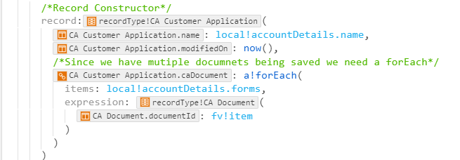

# Record Constructor
- Add Record type
- Add parentheses `()` after the record
- inside the `()` type the name of the field and you will see that the field for the record is auto-suggested
    - add the value after it to pass in the value you want to store 
