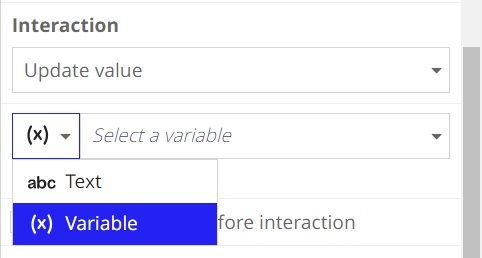
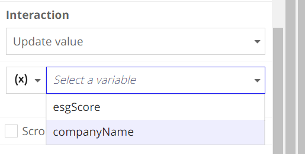

# Create Robotic Task

## Use the Task Recorder
**Once your resource is Online, you can use the Appian Task Recorder to record your automation.**
1. Select new Robotic task from Designer
    - Name the task
    - Select the robot Pool
    - Click Create, Click Save
2. In the Main section, click Start Recording
    - Verify the robot you created is selected, and click OK to launch the task recorder on your device
3. In the task recorder, click Select Application:
    - If you are using Windows, select any browser.
    - If you are using Mac, select any browser other than Chrome
        - There is a known Chrome driver defect that impacts running robotic tasks on Mac computers.
4. Complete the actions that you want your Robotic Task to complete
    - As you are doing this, the task recorder is recording your interactions and each action, you can rename it to be more intuitive
    - you can hover items, click Actions, and select Get attribute to collect data
    - you can click into action on the task recorder and Under Save into, click the plus button to create a new variable to save the values into

5. When all actions are completed Close the browser, and click Done on the task recorder
    - Name the group, and click Add Group and Close Recorder
    - Appian RPA will auto-generate robotic task steps based on the actions you completed
6. Update the Process
    - back in the robotic task, click Save Changes
    - expand the Setup and Clean Up sections
    - configure the process setup and clean up
        - example: drag and drop the Open browser action to the Setup section and the Close browser action to the Clean Up section
            - This is a best practice, as it makes it easier to use your robotic task for even more advanced use cases, like looping through a list of company names.
    - you can In the Variables pane, click the plus to create a new Process Variable
    
        - be sure to update the variable in the action under the interaction section
        
        
    - if your actions requires you to scroll togetto it be sure to check the `Scroll to element before interaction` check box
    - if you actions requires you to use the keyboard  Drag and drop `Press keyboard Shortcut` actions where needed and configure it to use the required keyboard keys
7. Save and Test
    -  Allow the task to run completely
    - task has completed when the browser automatically closes at the end
    - To verify the process ran successfully, look at your Process Workflow. All steps should have a green check mark next to them.
